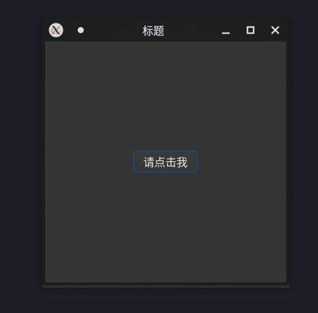

= Kotlin Native GTK4
:experimental:
:icons: font
:toc: right
:toc-title: 目录
:toclevels: 4
:source-highlighter: rouge

> 使用 Kotlin Native 和  GTK4 绘制 GUI

.注意：
. kotlin native 暂无法导入资源文件至二进制包

== 准备

[source,bash]
----
pacman -S gtk4 libadwaita curl base-devel
----

== 测试

[source,bash]
----
./gradlew runReleaseExecutableNative
----

TIP: 你需要在机器上安装 JDK 和 gcc 工具链才可正常编译可运行

== 截图

源码位于： link:src/nativeMain/kotlin/Main.kt[Main.kt]
